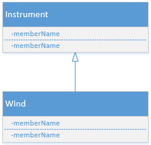

## 第七章 复用类
***
#### 1. 组合语法
1）对于非基本类型的对象，必须将其引用置于新的类中，但可以定义基本类型数据。  
2）每一个非基本类型的对象都有一个toString()方法，而且当编译器需要一个String而你却只有一个对象时，该方法便会被调用。  
3）初始化一个类中的对象引用有如下四种方式：
* 1.在定义对象的地方。这意味着它们总能够在构造器调用之前被初始化。
* 2.在类的构造器中。
* 3.就在正要使用这些对象之前，这种方式成为惰性初始化(Delayed initialization)。在生成对象不值得及不必每次都生成对象的情况下，这种方式可以减少额外的负担。
* 4.使用实例初始化。
以下是这四种方式的示例：

```Java
// Constructor initialization with composition.
import static net.mindview.util.Print.*;

class Soap {
  private String s;
  Soap() {
    print("Soap()");
	//2.在类的构造器中初始化
    s = "Constructed";
  }
  public String toString() { return s; }
}	

public class Bath {
  private String // 1.在定义对象的地方初始化：
    s1 = "Happy",
    s2 = "Happy",
    s3, s4;
  private Soap castille;
  private int i;
  private float toy;
  public Bath() {
    print("Inside Bath()");
	//2.在类的构造器中初始化：
    s3 = "Joy";
    toy = 3.14f;
    castille = new Soap();
  }	
  // 4.实例初始化:
  { i = 47; }
  public String toString() {
    if(s4 == null) // 3.惰性初始化(Delayed initialization):
      s4 = "Joy";
    return
      "s1 = " + s1 + "\n" +
      "s2 = " + s2 + "\n" +
      "s3 = " + s3 + "\n" +
      "s4 = " + s4 + "\n" +
      "i = " + i + "\n" +
      "toy = " + toy + "\n" +
      "castille = " + castille;
  }	
  public static void main(String[] args) {
    Bath b = new Bath();
    print(b);
  }
} /* Output:
Inside Bath()
Soap()
s1 = Happy
s2 = Happy
s3 = Joy
s4 = Joy
i = 47
toy = 3.14
castille = Constructed
*///:~
```
#### 2.继承语法
1）当创建一个类时，总是在继承，因此，除非已明确指出要从其他类中继承，否则就是在隐式地从Java的标准根类Object进行继承。  

2）继承关键字`extends`：继承会自动得到基类中所有的域和方法。  

3）调用另外一个类的main函数的方式与调用另外一个类的普通静态函数相同，即`类名.main(args);`，args可以是主调用类从命令行获得的参数，也可以是其他任意的String数组。  

4）可以为每个类都创建一个main方法。这种在每个类中都设置一个main方法的技术可使每个类的单元测试都变得简单易行。而且在完成单元测试之后，也无需删除main(),可以留待下次测试。  

5）即使一个类只具有包访问权限，其public main()仍然是可以访问的。  

6）为了继承，一般的规则是将所有的数据成员都指定为private，将所有的方法指定为public（protected members also allow access by derived classes）。   

7）Java用==super==关键字表示超类（父类）。表达式`super.fun();`可以调用父类中的函数(此处是调用函数fun())。  

###### 2.1 初始化基类
==注意：==基类=父类；导出类=子类。  
1）当创建了一个导出类的对象时，该对象包含了一个基类的子对象，该子对象被包装在导出类对象内部。
2）基类子对象的初始化：在构造器中调用基类构造器来执行初始化。在执行基类构造器之前，定义处初始化、实例初始化等均会被执行。==Java会自动在导出类的构造器中插入对基类构造器的调用。==
示例代码：
```Java
// Constructor calls during inheritance.
import static io.github.wzzju.util.Print.*;

class Art {
  private String art = " test art.\n";
  private String artS;
  {
	  artS = " ART";
  }
  Art() { print("Art constructor"+art+artS); }
}

class Drawing extends Art {
  private String draw = " test drawing.\n";
  private String drawS;
  {
	  drawS = " DRAW";
  }
  Drawing() { print("Drawing constructor"+draw+drawS); }
}

public class Cartoon extends Drawing {
  public Cartoon() { print("Cartoon constructor"); }
  public static void main(String[] args) {
    Cartoon x = new Cartoon();
  }
} /* Output:
Art constructor test art.
 ART
Drawing constructor test drawing.
 DRAW
Cartoon constructor
*///:~
```
可以看出，构建过程是从基类“向外”扩散的，所以基类在导出类构造器可以访问它之前，就已经完成初始化了。当然，默认构造器也会逐层调度基类的构造器。
###### 2.2 带参数的构造器
* 编译器可以自动调用默认的构造函数，是因为它们没有任何参数。但是如果没有默认的基类构造函数，或者想调用一个带参数的基类构造函数，必须使用关键字super显示地编写调用基类构造函数的语句，并且配以适当的参数列表。
* 如果基类没有默认构造器（无参构造器），导出类不显式的调用基类的带参构造器，则编译器会报错。
* ==格外注意：==
	- 调用基类构造器必须是在导出类构造器中要做的第一件事，否则编译器会报错。
	- 而覆盖父类的方法时，可以在做完子类要做的事情之后再调用父类对应的方法。Java编程思想中在该种情况下都是放在最后才调用父类对应的方法。

#### 3.代理
代理是第三种复用代码的关系，Java并没有提供对它的直接支持。它是继承和组合之间的中庸之道：
* 首先，我们需要将一个成员对象置于所要构造的类中（就像组合）；
* 其次，我们需要在新类中暴露该成员对象的所有方法（就像继承）或该成员对象的所有方法的某个子集。  

示例代码：

```Java
public class SpaceShipControls {
  void up(int velocity) {}
  void down(int velocity) {}
  void left(int velocity) {}
  void right(int velocity) {}
  void forward(int velocity) {}
  void back(int velocity) {}
  void turboBoost() {}
}

public class SpaceShipDelegation {
  private String name;
  private SpaceShipControls controls =
    new SpaceShipControls();
  public SpaceShipDelegation(String name) {
    this.name = name;
  }
  // Delegated methods:
  public void back(int velocity) {
    controls.back(velocity);
  }
  public void down(int velocity) {
    controls.down(velocity);
  }
  public void forward(int velocity) {
    controls.forward(velocity);
  }
  public void left(int velocity) {
    controls.left(velocity);
  }
  public void right(int velocity) {
    controls.right(velocity);
  }
  public void turboBoost() {
    controls.turboBoost();
  }
  public void up(int velocity) {
    controls.up(velocity);
  }
  public static void main(String[] args) {
    SpaceShipDelegation protector =
      new SpaceShipDelegation("NSEA Protector");
    protector.forward(100);
  }
}
```
==使用代理的好处：==使用代理时，我们可以拥有更多的控制力，因为我们可以选择只提供在成员对象中的方法的某个子集。

#### 4.结合使用组合和继承
同时使用组合和继承，并配以必要的构造器初始化，可以创建更加复杂的类。
###### 4.1.确保正确清理
```Java
try{
	//......
}finally{
	x.dispose();
}
```
上述代码中的finally子句表示的是“无论发生什么事，一定要为x调用dispose()。”
在清理方法（dispose()）中，必须注意对基类清理方法和成员对象清理方法的调用顺序，以防某个子对象依赖于另外一个子对象的情形发生。  
* 一般，采用与C++编译器在其析构函数上所施加的形式：==首先，执行类的所有特定的清理工作，其顺序同生成顺序相反（通常这就要求基类元素仍旧存活）；然后调用基类的清理方法。==
* ==注意：==除了内存以外，不能依赖垃圾回收器去做任何事。如果需要进行清理，最好编写自己的清理方法，但是不要使用finalize()。

###### 4.2名称屏蔽
* 如果Java的基类拥有某个已被多次重载的方法名称，那么在导出类中重新定义该方法名称并不会屏蔽器在基类中的任何一个版本（这一点与C++不同）。因此，无论是在该层或者它的基类中对方法进行定义，重载机制都可以正常工作。
* 如果你只是想覆写某个方法，但是害怕不留心重载了该方法（而并非覆写了该方法）时，可以选择添加`@Override`注解（Java SE5新增）。
* 在一个方法前添加了`@Override`注解，该方法便只能是覆写父类的某个方法，若是不留心写成了重载，编译器便会报错。这样`@Override`注解便可以防止你在不想重载时而意外地进行了重载。

#### 5.在组合和继承之间选择
* 组合技术通常用于想在新类中使用现有类的功能而非它的接口这种形式。即，在新类中嵌入某个对象，让其实现所需要的功能，但是新类的用户看到的只是为新类所定义的接口，而非所嵌入对象的接口。为取得此效果，需要在新类中嵌入一个现有类的private对象。（特例，如Car将成员对象（Window/Wheel/Engine...）声明为public，一般情况下应该使域成为private。）
* 在继承的时候，使用某个现有类，并开发一个它的特殊版本。通常，这意味着你在使用一个通用类，并为了某种特殊需要而将其特殊化。
* “is-a”(是一个)的关系是用继承来表达的，而“has-a”(有一个)的关系则是用组合来表达的。

#### 6.protected关键字
* ==protected关键字的作用：==就类用户而言，其是private的，但对于任何继承于此类的子类或其他任何位于同一个包内的类来说，它却是可以访问的。（protected也提供了包内访问权限。）  
* ==注意：==尽管可以创建protected域，但是最好的方式还是将域保持为private；你应当一直保留“更改底层实现”的权利。然后通过protected方法来控制类的继承者的访问权限。

```Java
class A{
  private String name;
  protected void set(String name){
    this.name = name;
  }
  public A(String nm){
    name = nm;
  }
  //......
}

class B extends A{
  private int number;
  public B(String nm, int num){
    super(nm);
	number = num;
  }
  public void change(String nm, int num){
    set(nm);//因为set()函数是protected的，故无论B和A是否在一个包内，在此都可以访问。
	number = num;
  }
  //......
}
```
#### 7.向上转型
<div align = "center">
  
类继承图
</div>

由导出类转型成基类，在继承涂上是向上移动的，因此一般称为*向上转型(upcasting)*。由于向上转型是从一个较专用类型向较通用类型转换，所以总是很安全的。换句话说，导出类是基类的一个超集。它可能比基类含有更多的方法，但它必须至少具备基类中所含有的方法。在向上转型的过程中，类接口中唯一可能发生的事情是丢失方法，而不是获取它们。
###### 再讨论组合和继承
相比于继承，运用组合技术使用现有类来开发新的类的做法更常见。应该慎用继承技术。
* 到底是该用组合还是用继承，一个最清晰的判断方法就是问一问自己是否需要从新类向基类进行向上转型。如果必须向上转型，则继承是必要的；但是如果不需要，则应当好好考虑自己是否需要继承。

#### 8.final关键字


